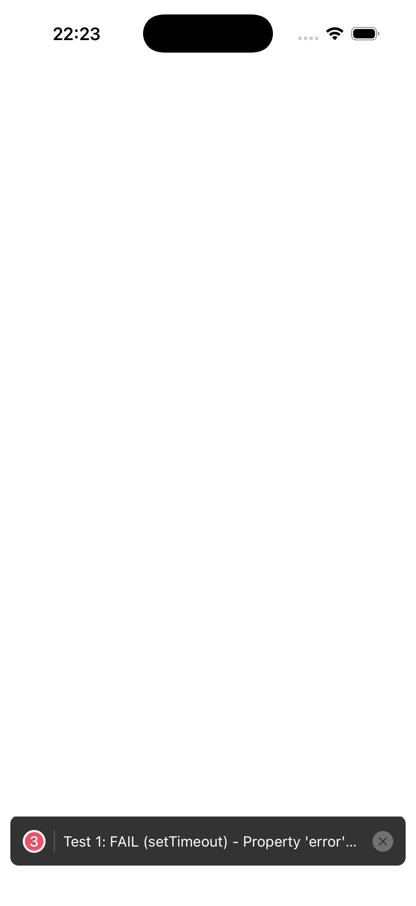

# Hermes Catch Binding Bug

`ReferenceError: Property 'error' doesn't exist` when accessing a catch binding inside a deferred closure in React Native with Hermes.

Related: [facebook/hermes#864](https://github.com/facebook/hermes/issues/864), [facebook/hermes#1969](https://github.com/facebook/hermes/issues/1969)

## The Bug

```javascript
try {
  throw new Error('test');
} catch (error) {
  console.log(error.message); // works
  setTimeout(function () {
    console.log(error.message); // ReferenceError: Property 'error' doesn't exist
  }, 0);
}
```

## Findings

**All deferral methods fail** — not just `setTimeout` (native bridge), but also `Promise.resolve().then()` and `queueMicrotask()` (pure JS, no native bridge). This rules out the native timer implementation as the cause. The bug is in the Hermes runtime itself when embedded in the RN app.

| Deferral method | Native bridge? | Result in RN app |
|---|---|---|
| `setTimeout` | Yes | FAIL |
| `Promise.resolve().then()` | No | FAIL |
| `queueMicrotask()` | No | FAIL |

All three work correctly on standalone Hermes CLI (`hermes repro.js`).



## Reproduction

`repro.js` — minimal Metro require polyfill (71 lines) replicating the RN execution path. Runs on standalone Hermes CLI but does **not** reproduce the bug there.

To reproduce in an RN app:

```bash
npx @react-native-community/cli init HermesCatchRepro --version 0.79.7
```

Replace `index.js`:

```javascript
import {AppRegistry} from 'react-native';

try {
  throw new Error('catch-binding-bug');
} catch (error) {
  console.log('inside catch:', error.message);
  setTimeout(function () {
    try {
      console.log('deferred:', error.message);
    } catch (e) {
      console.error('BUG REPRODUCED:', e.message);
    }
  }, 100);
}

AppRegistry.registerComponent('HermesCatchRepro', () => () => null);
```

## Workaround

Hoist to `let` before the try/catch — Babel lowers `let` → `var`:

```javascript
let capturedError;
try {
  throw new Error('test');
} catch (error) {
  capturedError = error;
  setTimeout(function () {
    console.log(capturedError.message); // works
  }, 0);
}
```

## Environment

- React Native 0.78.x, 0.79.7 (also likely all versions through 0.85.0)
- Hermes (default engine)
- iOS simulator, Xcode 26.4
- Standalone Hermes CLI does NOT reproduce
